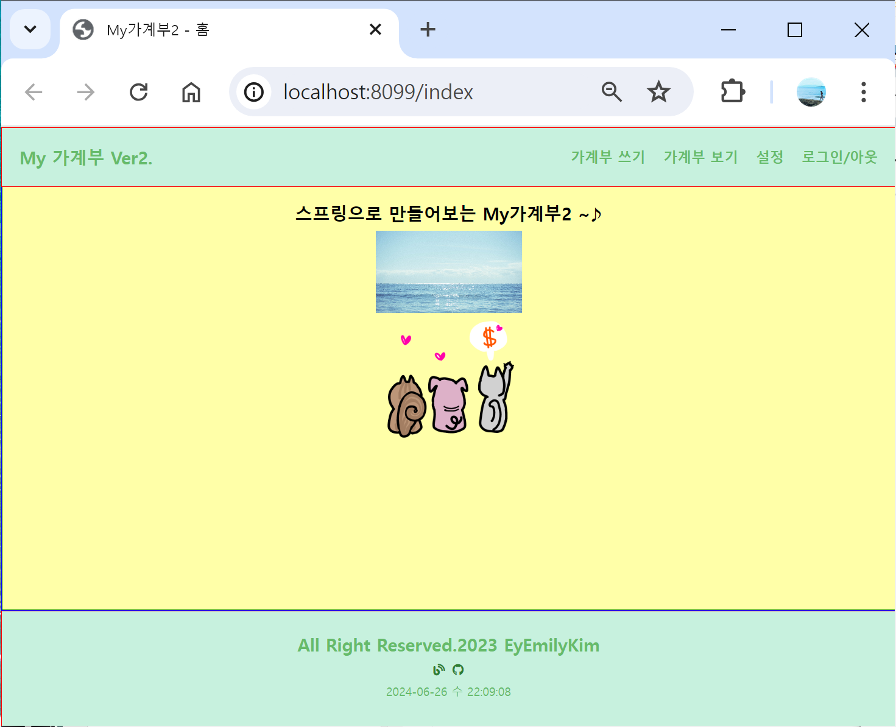

# My 가계부 2
### 💰 Java와 Spring으로 만들어보는 나만의 가계부 어플리케이션
- **[Servlet (v.1)](https://github.com/EyEmilyKim/MyPrj_MyAccountBook_servlet) → Spring (v.2) → [Spring Boot (v.3)](https://github.com/EyEmilyKim/MyPrj_MyAccountBook3_springBoot/tree/main)로 고도화**하며 이어나간 개인 프로젝트.
- Spring 기본 사이클 실습 후 Spring Boot로 넘어갈 목적으로 어플리케이션 완성이 아닌 일부 기능만 구현했다.
- **과거 프로젝트(v.1)와 다른 점** :
    - Spring 프레임 워크 적용
    - Tiles 라이브러리 적용

## 📅 개발 기간
- **핵심 개발** : 2023.04.22 ~ 2023.04.28 (7일)

## 🛠️ 기술 스택
- **Front** : JSP, JSTL / Javascript
- **Back** : Java 8 / Spring / Oracle

## 샘플 화면

